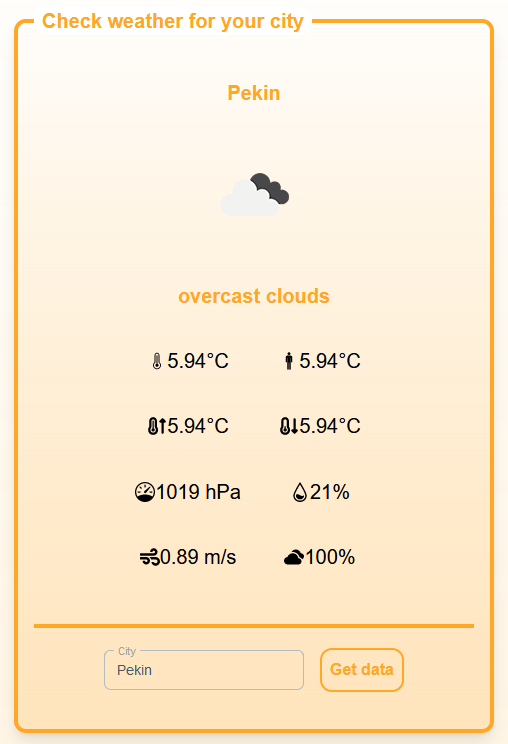
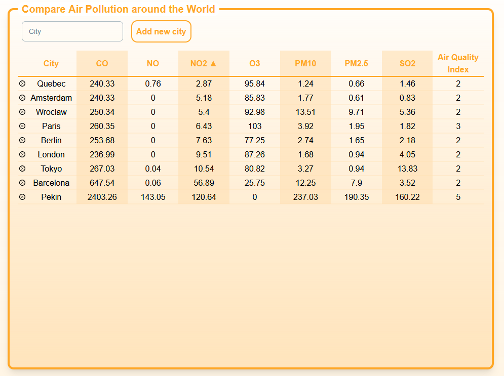

# WeatherStats
WeatherStats is app developed as recruitment task for Nokia. App fetches data from OpenWeather API. \
It allows user to see weather conditions in selected city and display air pollution and quality in sortable table by every value.

# Getting started
## Prerequisities
- Nodejs v20.10.0
- npm 10.2.3
## Installation
- Clone the repo
```bash
git clone https://github.com/Chavoniasty/nokia-recruitment-task
cd nokia-recruitment-task
```
- Install all packages
```bash
npm install
```

- Make .env file with yours API key
```
API_KEY={your_API_key}
```
- Run proxy server
```bash
node .\src\index.js
```
- Go to client folder and install all packages
```bash
cd .\client\
npm install
```
- Run app
```bash
npm run dev
```
## Usage
### Endpoints
- GET /currentWeather  \
params: city \
response: [description, temperature info, wind info, cloudiness, icon ID]
```
[
  'overcast clouds',
  {
    temp: 6.94,
    feels_like: 6.94,
    temp_min: 6.94,
    temp_max: 6.94,
    pressure: 1019,
    humidity: 21,
    sea_level: 1019,
    grnd_level: 1014
  },
  { speed: 0.89, deg: 115, gust: 0.48 },
  100,
  '04n'
]
```
- GET /getPollution \
params: city \
response: object with every pollution, air quality index and city
```
{
  co: 343.8,    
  no: 0,        
  no2: 19.36,   
  o3: 72.24,    
  so2: 23.37,   
  pm2_5: 15.04, 
  pm10: 18.77,  
  nh3: 6.97,    
  aqi: 2,       
  city: 'Warsaw'
}
```

### Weather View

### Table View



